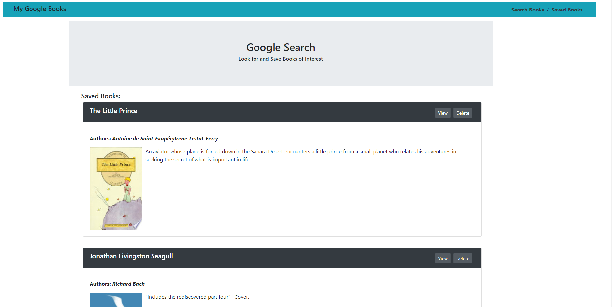

# My Google Books
_[Click Here for the Heroku’s Deployed Application](https://rocky-lowlands-25767.herokuapp.com/savedBooks)_

## Overview

 React-based Google Books Search app. This application uses React components, works with helper/util functions, and utilizes React lifecycle methods to query and display books based on user searches. It also uses Node, Express and MongoDB so that users can save books to review or purchase later.

## Technologies
**_The MERN Stack was used to complete this application:_**
 * MongoDB
 * Express.js
 * React.js
 * Node.js

### User Story 

* An user is able to Search and Save books of interest. So he/she are able to comeback to the created list. 

## Business Context

A consumer will be able to store books of interst for quick access to either buy it or get information.

- - -
### __This is a link to a deployed application:__

_[Click Here for the Heroku’s Deployed Application](https://rocky-lowlands-25767.herokuapp.com/savedBooks)_

- - -
### **This is a preview of the app**

